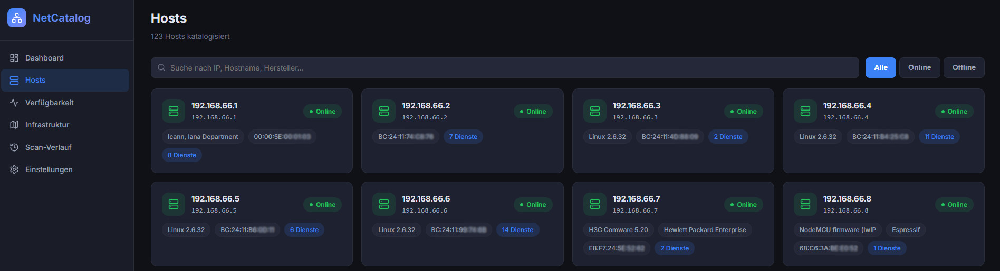
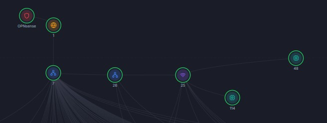

# NetCatalog

**Automatische Netzwerk-Inventarisierung, Topologie-Mapping und Service-Erkennung für komplexe IT-Infrastrukturen**

NetCatalog ist ein Full-Stack-System zur automatischen Erfassung und Verwaltung von Netzwerken. Es führt intelligente Netzwerk-Scans durch, identifiziert Geräte (Server, Router, Switches, WLAN-APs, VMs), erkennt deren Dienste, erstellt dynamische Netzwerk-Topologien und verwaltet alles in einem modernen Web-Dashboard mit Dark-Mode UI.


---

## 🎯 Kernfunktionen

### Netzwerk-Scanning & Geräte-Erkennung
- **Automatische Host-Erkennung** - Ping-Sweep + SYN-Scan für Port-Inventarisierung
- **50+ Services erkannt** - Banner-Grabbing, HTTP-Probing, Signatur-Matching, Version-Erkennung
- **OS-Fingerprinting** - Betriebssystem-Erkennung (Linux, Windows, macOS, etc.)
- **MAC-Adresse Lookup** - Automatische Vendor-Identifikation (AVM, Proxmox, HP, etc.)
- **Geplante Scans** - Konfigurierbare Cron-basierte automatische Scans
- **Scan-Historie** - Vollständiger Audit-Trail mit Zeiten und Änderungsverfolgung

### Deep Discovery & Topologie-Mapping  
**Innovative Multi-Methoden-Topologie-Analyse:**

1. **ARP-Tabellen-Analyse** - L2-Neighbor-Erkennung (Switch-Mappings)
2. **Traceroute-Analyse** - Hop-Erkennung und Router-Identifikation
3. **Broadcast Ping Clustering** - L2-Segment-Gruppierung
4. **SNMP MAC-Tabellen** - Switch-Port-zu-MAC-Mapping (mit Port-Konfidenz)
5. **SNMP LLDP Neighbors** - Physische Link-Erkennung
6. **mDNS/Bonjour** - Service- und Geräte-Anreicherung
7. **SSDP/UPnP** - Automatische Geräte-Discovery
8. **TTL-Fingerprinting** - Hop-Count-Schätzung
9. **UniFi Controller Integration** - WLAN-Client → AP Mapping
10. **Proxmox API Integration** - VM → Hypervisor Mapping (MAC-basiert)
11. **AVM FritzBox Integration** - WLAN-Geräte-Discovery via TR-064 Protocol

### Intelligente Klassifizierung
- **Device-Typen** - Router, Gateway, Switch, Access Point, Hypervisor, VM, Server, Device
- **Automatische Klassifizierung** - Heuristische Regeln basierend auf:
  - Erkannte Dienste (SSH, SMB, SNMP, etc.)
  - Topologie-Position (Root, Leaf, Hypervisor)
  - MAC-Adressen (Hersteller-Signaturen)
  - Betriebssystem
  - SSDP Server-String
- **Manuelles Überschreiben** - User kann Klassifizierung korrigieren

### Verfügbarkeits-Tracking
- **24h-Zeitleisten** - Detaillierte Verfügbarkeits-Historie pro Host
- **30-Tage-Statistiken** - Uptime-Metriken und Trends
- **Änderungsverfolgung** - Wann kam Host online/offline
- **Service-Tracking** - Port-Verfügbarkeit im Zeitverlauf

### Web-Dashboard (React)
- **Responsive Design** - Desktop und Mobile optimiert
- **Dark-Mode UI** - Modernes Design mit hohem Kontrast
- **Host-Übersicht** - Mit Status-Icons, IP, MAC, OS-Info
- **Detailseiten** - Technische Informationen pro Host
- **Service-Dashboard** - Port, Protocol, Versionen, Banner
- **InfrastrukturMAP** - Interaktive Topologie-Visualisierung
- **Verfügbarkeits-Charts** - Zeitbasierte Uptime-Ansicht
- **Scan-Historie** - Alle durchgeführten Scans mit Details
- **Netzwerk-Einstellungen** - Scan-Netzwerk, Interval, SNMP, API-Tokens

### Enterprise-Integrationen
- **Proxmox Virtualisierung** - VM-Identifikation und Hypervisor-Zuordnung
- **AVM FritzBox Router** - WLAN-Geräte-Erkennung, Credentials-Management
- **UniFi Controller** - WLAN-Infrastruktur-Mapping
- **SNMP v2c** - Automatische Netzwerk-Geräte-Abfrage
- **LLDP Protocol** - Physische Link-Entdeckung

---

## 📸 Screenshots

### Dashboard - Host-Übersicht


### InfrastrukturMAP - Topologie-Visualisierung


---

## 🏗️ Systemarchitektur

```
┌─────────────────────────────────────────────────────────────┐
│                    Web-Frontend (React)                      │
│  Dashboard | Hosts | Services | Map | Settings | History    │
└──────────────────────┬──────────────────────────────────────┘
                       │ REST API
┌──────────────────────┴──────────────────────────────────────┐
│              Node.js Express Server (src/server.js)          │
│  • REST API (api.js)                                         │
│  • Authentication & Settings                                │
│  • Scheduler (Cron)                                          │
└──────────────────────┬──────────────────────────────────────┘
                       │
      ┌────────────────┼────────────────┐
      │                │                │
  ┌───▼───┐     ┌─────▼──────┐   ┌────▼────┐
  │ Scanner│     │DeepDiscovery│   │Services │
  │ Engine │     │ Module      │   │Manager  │
  └───┬───┘     └─────┬──────┘   └────┬────┘
      │              │                │
      ├─ nmap        ├─ ARP Analysis  │
      ├─ TCP Scan    ├─ Traceroute    │
      ├─ Services    ├─ SNMP (MAC)    │
      ├─ OS-FP       ├─ LLDP          │
      └─ Banner      ├─ mDNS/SSDP     │
                     ├─ UniFi API     │
                     ├─ Proxmox API   │
                     └─ FritzBox TR064│
                       
                    ┌──────────────┐
                    │ PostgreSQL DB│
                    │ (hosts, svcs,│
                    │  scans, ...)  │
                    └──────────────┘
```

---

## 📋 Voraussetzungen

### System-Anforderungen
- **OS**: Linux (Debian 11+, Ubuntu 20.04+, etc.)
- **RAM**: ≥ 2 GB
- **Disk**: ≥ 10 GB (für Datenbank & Logs)

### Software-Abhängigkeiten
- **Node.js** ≥ 18 ([nodejs.org](https://nodejs.org))
- **PostgreSQL** ≥ 13 ([postgresql.org](https://www.postgresql.org))
- **nmap** ([nmap.org](https://nmap.org)) - für Port-Scans
- **curl** - für HTTP-Probing (meist vorinstalliert)
- **git** - zum Klonen des Repositories

### Netzwerk-Anforderungen
- Root-Zugriff für SYN-Scan (oder CAP_NET_RAW Capabilities)
- Direkter Layer-2 Zugriff auf Target-Netzwerk
- Optional: SNMP v2c Zugriff auf Switches
- Optional: API-Zugriff auf Proxmox/UniFi/FritzBox Geräte

---

## 📦 Installation

### ⚡ Automatisierte Installation (empfohlen)

Für schnelle Einrichtung auf frischen Linux-Systemen (Ubuntu/Debian/RHEL):

```bash
git clone https://github.com/bmetallica/NetCatalog.git
cd NetCatalog
chmod +x quickinstall.sh
./quickinstall.sh
```

Das Script automatisiert alle folgenden Schritte:
- ✓ Abhängigkeiten prüfen & installieren
- ✓ PostgreSQL einrichten (oder bestehende Datenbank nutzen)
- ✓ Dependencies installieren
- ✓ Datenbank initialisieren
- ✓ Frontend bauen
- ✓ Optional: Systemd Service einrichten

👉 Siehe [QUICKINSTALL_GUIDE.md](./QUICKINSTALL_GUIDE.md) für detaillierte Informationen.

---

### 1. Repository klonen (manuelle Installation)

```bash
git clone https://github.com/bmetallica/NetCatalog.git
cd NetCatalog
```

### 2. PostgreSQL-Datenbank vorbereiten

```bash
# Datenbank und User erstellen
sudo -u postgres psql <<EOF
CREATE USER netcatalog WITH PASSWORD 'your_secure_password';
CREATE DATABASE netcatalog OWNER netcatalog;

-- Erforderliche Extensions für PostgreSQL
\c netcatalog
CREATE EXTENSION IF NOT EXISTS "uuid-ossp";
CREATE EXTENSION IF NOT EXISTS "inet";
EOF
```

### 3. Abhängigkeiten installieren

```bash
npm run install:all
```

Dies installiert sowohl Backend- als auch Frontend-Abhängigkeiten:
```bash
npm install                    # Backend (Node.js)
cd frontend && npm install     # Frontend (React)
cd ..
```

### 4. Umgebungsvariablen konfigurieren

```bash
cp .env.example .env
nano .env  # oder editor deiner Wahl
```

**`.env` Konfiguration:**

```env
# === DATABASE ===
DB_HOST=localhost
DB_PORT=5432
DB_NAME=netcatalog
DB_USER=netcatalog
DB_PASSWORD=your_secure_password

# === NETZWERK SCANNING ===
SCAN_NETWORK=192.168.66.0/24
SCAN_INTERVAL=30              # Minuten
SCAN_PORTS=1-10000            # Port-Range

# === SERVER ===
PORT=3000
NODE_ENV=production

```

### 5. Datenbank initialisieren

```bash
npm run db:init
```

Dies erstellt:
- Alle Tabellen (`hosts`, `services`, `scans`, `settings`, `host_availability`)
- Indizes für Performance-Optimierung
- Initiale Settings mit Defaults

**Erzeugte Datenbank-Tabellen:**

| Tabelle | Zweck | Spalten |
|---------|-------|---------|
| `hosts` | Host-Inventar | ip_address, hostname, mac_address, vendor, os_guess, device_type, parent_host_id, discovery_info, status, first_seen, last_seen |
| `services` | Service-Inventar | host_id, port, protocol, state, service_name, service_product, service_version, http_title, banner, identified_as, extra_info |
| `scans` | Scan-Historie | network, status, hosts_found, services_found, started_at, finished_at, error |
| `host_availability` | 24h-Verfügbarkeit | host_id, checked_at, status |
| `settings` | Konfiguration | key, value, description |

**FritzBox & Proxmox Spalten:**
```sql
-- FritzBox Integration
ALTER TABLE hosts ADD COLUMN fritzbox_host VARCHAR(255);       -- URL der FritzBox
ALTER TABLE hosts ADD COLUMN fritzbox_username VARCHAR(255);   -- Benutzername
ALTER TABLE hosts ADD COLUMN fritzbox_password TEXT;           -- Passwort

-- Proxmox Integration
ALTER TABLE hosts ADD COLUMN proxmox_api_host VARCHAR(255);    -- Proxmox API URL
ALTER TABLE hosts ADD COLUMN proxmox_api_token_id VARCHAR(255);-- Token ID
ALTER TABLE hosts ADD COLUMN proxmox_api_token_secret TEXT;    -- Token Secret
```

### 6. Frontend bauen

```bash
npm run build:frontend
```

Dies kompiliert die React-App und generiert `/frontend/dist/` für Production-Serving.

### 7. Systemd Service einrichten (empfohlen)

Erstelle `/etc/systemd/system/netcatalog.service`:

```ini
[Unit]
Description=NetCatalog - Network Inventory & Service Discovery
After=network.target postgresql.service
Wants=postgresql.service

[Service]
Type=simple
User=netcatalog
WorkingDirectory=/opt/netcatalog
Environment="NODE_ENV=production"
EnvironmentFile=/opt/netcatalog/.env
ExecStart=/usr/bin/node /opt/netcatalog/src/server.js
Restart=always
RestartSec=10
StandardOutput=journal
StandardError=journal
SyslogIdentifier=netcatalog

# Security
PrivateTmp=yes
NoNewPrivileges=true
ReadOnlyPaths=/etc

[Install]
WantedBy=multi-user.target
```

Aktivieren und starten:

```bash
sudo systemctl daemon-reload
sudo systemctl enable netcatalog
sudo systemctl start netcatalog
sudo systemctl status netcatalog
```

Logs ansehen:

```bash
journalctl -u netcatalog -f          # Live-Logs
journalctl -u netcatalog -n 100      # Letzte 100 Zeilen
```

### 8. Reverse Proxy konfigurieren (optional, empfohlen)

**Nginx Beispiel:**

```nginx
server {
    listen 80;
    server_name netcatalog.example.com;
    return 301 https://$server_name$request_uri;
}

server {
    listen 443 ssl http2;
    server_name netcatalog.example.com;

    ssl_certificate /etc/letsencrypt/live/netcatalog.example.com/fullchain.pem;
    ssl_certificate_key /etc/letsencrypt/live/netcatalog.example.com/privkey.pem;

    location / {
        proxy_pass http://localhost:3000;
        proxy_set_header Host $host;
        proxy_set_header X-Real-IP $remote_addr;
        proxy_set_header X-Forwarded-For $proxy_add_x_forwarded_for;
        proxy_set_header X-Forwarded-Proto $scheme;
    }

    location /api/scan {
        proxy_pass http://localhost:3000/api/scan;
        proxy_read_timeout 300s;  # Scans können lange dauern
        proxy_send_timeout 300s;
    }
}
```

---

## 🚀 Verwendung

### Dashboard öffnen

```
http://localhost:3000
```

Bei Production mit HTTPS:
```
https://netcatalog.example.com
```

### Netzwerk-Scan starten

1. **Dashboard** → **Settings** öffnen
2. **Netzwerk** → Scan-Netzwerk eingeben (z.B. `192.168.66.0/24`)
3. **Scan starten** klicken
4. Fortschritt im Dashboard verfolgen

### Deep Discovery aktivieren

Deep Discovery wird automatisch nach jedem Scan ausgeführt. Für manuelle Trigger:

```bash
curl -X POST http://localhost:3000/api/scan/deep
```

**Deep Discovery - Was wird analysiert:**
- ARP-Tabellen von allen reachable Hosts
- Traceroute-Paths zu Gateways
- SNMP Queries (falls aktiviert)
- SSDP/UPnP Device Discovery
- mDNS Service Enumeration
- UniFi Controller (falls konfiguriert)
- Proxmox API (falls konfiguriert)
- AVM FritzBox API (falls konfiguriert)

### API-Integration: FritzBox (AVM)

**Credentials speichern:**

```bash
curl -X PUT http://localhost:3000/api/hosts/51/fritzbox \
  -H "Content-Type: application/json" \
  -d '{
    "fritzbox_host": "http://192.168.66.91",
    "fritzbox_username": "admin",
    "fritzbox_password": "your_password"
  }'
```

Dies triggert automatisch Deep Discovery und:
- Entdeckt alle WLAN-Geräte
- Erstellt neue Hosts mit Parent-Beziehung zur FritzBox
- Speichert Signal-Strength und Speed-Info

**Verbindung testen:**

```bash
curl -X POST http://localhost:3000/api/fritzbox/test \
  -H "Content-Type: application/json" \
  -d '{
    "fritzbox_host": "http://192.168.66.91",
    "fritzbox_username": "admin",
    "fritzbox_password": "your_password"
  }'
```

### API-Integration: Proxmox

Ähnlich wie FritzBox für VM-Inventarisierung und Hypervisor-Mapping.

### SNMP Konfiguration

```bash
# In Settings speichern:
# Key: snmp_community
# Value: public,private,community123
```

Deep Discovery verwendet diese Communities automatisch für MAC-Table-Abfragen.

---

## 📊 API-Referenz

### Hosts

```bash
# Alle Hosts
GET /api/hosts

# Spezifischer Host
GET /api/hosts/{id}

# Host aktualisieren
PUT /api/hosts/{id}

# Host löschen
DELETE /api/hosts/{id}
```

### Services

```bash
# Services eines Hosts
GET /api/hosts/{id}/services

# Alle Services
GET /api/services?page=1&limit=50
```

### Scans

```bash
# Scan starten
POST /api/scan

# Deep Discovery starten
POST /api/scan/deep

# Scan-Historie
GET /api/scan/history?limit=10
```

### Topologie

```bash
# Topologie für InfrastrukturMAP
GET /api/topology

# Response: { hosts: [...], edges: [...] }
```

### Settings

```bash
# Alle Settings
GET /api/settings

# Setting aktualisieren
PUT /api/settings/{key}
```

---

## ⚙️ Konfiguration & Tuning

### Scan-Performance

**Port-Range anpassen:**
- `1-1000` - Schnell (~ 1-2 min pro Host)
- `1-5000` - Balance (~ 5-10 min)
- `1-65535` - Vollständig (~ 30+ min)

**Parallelisierung:**
- nmap wird mit `-sV --max-retries 1` ausgeführt für Geschwindigkeit
- Mehrere Hosts parallel gescannt

**SNMP Timeout erhöhen für langsame Netzwerke:**
```bash
# In deepDiscovery.js anpassen:
const SNMP_TIMEOUT = 5000;  // 5 Sekunden
```

### Datenbank-Optimierung

```sql
-- Große Datenbanken: Archivierung alter Daten
DELETE FROM scans WHERE finished_at < NOW() - INTERVAL '90 days';
DELETE FROM host_availability WHERE checked_at < NOW() - INTERVAL '30 days';

-- Vacuum & Reindex
VACUUM ANALYZE;
REINDEX INDEX CONCURRENTLY idx_services_last_seen;
```

### Deep Discovery Tuning

```bash
# In .env:
deep_discovery_enabled=true
deep_discovery_interval=60        # Alle 60 Minuten
```

**Deaktivieren bestimmter Methoden (in deepDiscovery.js):**
```javascript
// Comment out im runDeepDiscovery():
// discoverFromSnmp(topologyHosts, ...),    // SNMP deaktivieren
// discoverFromFritzBox(ipToHost),          // FritzBox deaktivieren
```

---

## 🔒 Sicherheit

### Authentifizierung
- ⚠️ **Aktuell:** Keine Authentication (Annahme: Private/Intranet-Umgebung)
- **Empfohlen:** Reverse Proxy mit OAuth2/Basic Auth

### Daten-Sicherheit
- Passwörter werden **gehashed** in der Datenbank gespeichert (bei Proxmox/FritzBox)
- ⚠️ **TODO:** Password-Verschlüsselung mit `crypto.encrypt()`
- SSL/TLS über Reverse Proxy (Nginx/Apache)

### Netzwerk-Zugriff
- Begrenzen Sie Port 3000 auf vertraute Subnets
- Nutzen Sie VPN/Jumphost für Remote-Zugriff
- UFW Firewall-Regel:
  ```bash
  sudo ufw allow from 192.168.66.0/24 to any port 3000
  ```


---

## 🐛 Troubleshooting

### Datenbank-Verbindung fehlgeschlagen

```bash
# PostgreSQL läuft?
sudo systemctl status postgresql

# Credentials prüfen
PGPASSWORD="your_password" psql -h localhost -U netcatalog -d netcatalog -c "SELECT 1"

# Logs ansehen
sudo tail -f /var/log/postgresql/postgresql.log
```

### Scans finden keine Hosts

```bash
# Netzwerk korrekt?
ping -c 1 192.168.66.1

# nmap manuell testen
sudo nmap -sn 192.168.66.0/24

# Firewall blockiert?
sudo ufw status
```

### Deep Discovery startet nicht

```bash
# Service-Logs
journalctl -u netcatalog -n 50 | grep -i deep

# Deep Discovery manuell
curl -X POST http://localhost:3000/api/scan/deep

# Scheduler-Status
systemctl status netcatalog
```

### FritzBox-Verbindung fehlgeschlagen

```bash
# Credentials korrekt?
curl -k --anyauth -u "admin:password" \
  "https://192.168.66.91:49000/MediaServerDevDesc.xml"

# Logs
journalctl -u netcatalog | grep -i fritz

# Port 49000 erreichbar?
nc -zv 192.168.66.91 49000
```

---

## 📈 Performance & Kapazität

| Metrik | Kapazität | Bemerkung |
|--------|-----------|----------|
| Hosts | 10,000+ | Abhängig von Scan-Interval |
| Services | 100,000+ | Indizes optimieren Queries |
| Scan-Zeit | 1-2 min (1000 Hosts) | nmap Parallelisierung |
| Deep Discovery | 5-10 min | Abhängig von Netzwerk-Komplexität |
| API Response | < 500ms | Für 1000 Hosts |

---

## 🤝 Beiträge & Lizenz

**Lizenz:** MIT


---

## 📚 Weitere Dokumentation

- [FritzBox Deep Discovery](./FRITZBOX_DEEP_DISCOVERY.md) - Detaillierte FritzBox-Integration
- [Proxmox Integration](./PROXMOX_INTEGRATION.md) - VM-Erkennung
- [API-Dokumentation](./API.md) - Vollständige REST-API-Referenz


---

**Letzte Aktualisierung:** Februar 2026  
**Version:** 1.0.0
